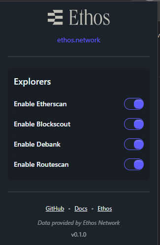
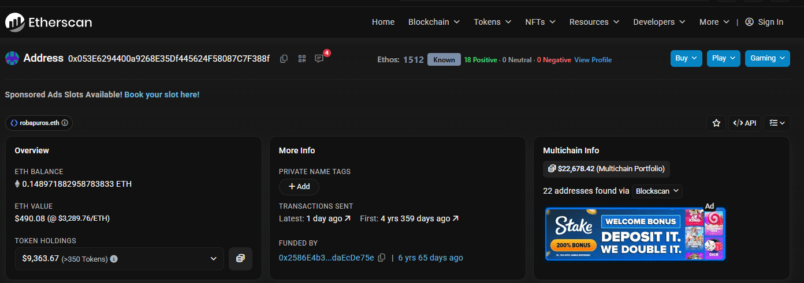
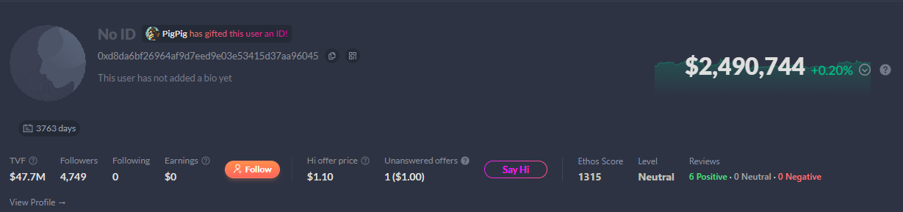
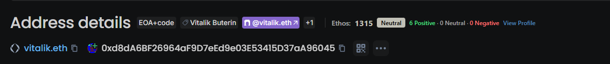
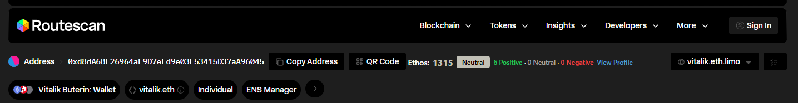

# Ethoscan Extension

Ethoscan is a Chrome Extension that displays Ethos Network reputation data inline on supported blockchain explorers.
The extension is strictly representational and does not perform interpretation, prediction, or judgment.

## Supported Explorers
- Etherscan
- Blockscout
- DeBank
- Routescan

## Screenshots

### Extension

### Etherscan

### DeBank

### Blockscout

### Routescan

## Usage

At the moment, the extension is installed manually in Chrome using Developer Mode.

1. Open Chrome and navigate to:
   `chrome://extensions/`

2. Enable Developer mode (top right).

3. Click Load unpacked.

4. Select the dist/ directory from this repository.

5. Open a supported explorer and navigate to an address page.
   Ethos reputation data will appear inline when available.

## What This Extension Shows
For detected blockchain addresses, the extension displays:
- Ethos score
- Ethos level
- Last review information when available

All data is fetched directly from Ethos Network API v2 and rendered without modification.

## Data Source
- Ethos Network API v2
- Endpoint: /api/v2/score/address
- No API key required

The extension does not infer ownership, intent, or safety.
It renders only the data provided by Ethos.

## Score Levels
The following score ranges and labels are locked and must not be changed:

- 0–799: Untrusted
- 800–1199: Questionable
- 1200–1399: Neutral
- 1400–1599: Known
- 1600–1799: Established
- 1800–1999: Reputable
- 2000–2199: Exemplary
- 2200–2399: Distinguished
- 2400–2599: Revered
- 2600–2800: Renowned

UI colors follow the official Ethos score breakdown.

## Technical Stack
- Runtime: Bun
- Language: TypeScript
- Bundler: Vite
- Styling: Tailwind CSS with DaisyUI
- Extension standard: Chrome Manifest V3

## Architecture Principles
- Representational only
- No labeling, judgment, or behavioral claims
- No scam or safety assertions
- Inline UI injection only
- No background tracking or analytics
- No inline scripts
- No eval usage

## Development Notes
- Vite requires an index.html file for build entry
- Chrome loads only compiled assets from the dist directory
- Content scripts inject bundled JavaScript and CSS

## Status
This project is under active development.
Explorer support is implemented incrementally.

## License
MIT - See [LICENSE](LICENSE.md) file for details
